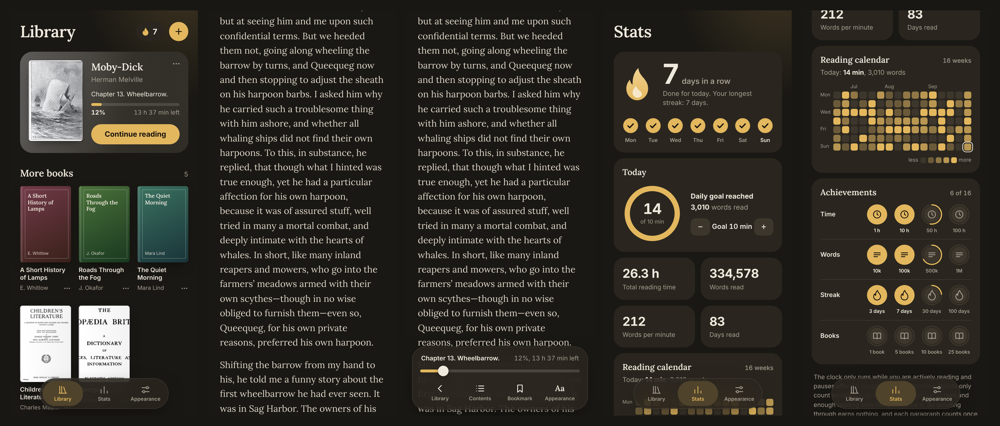

# Folio

An offline EPUB reader for the iPhone that runs in the browser. No account, no ads, no server: your books, reading position and stats stay on your device.

**Open the app: [moonveil177.github.io/folio](https://moonveil177.github.io/epub-reader/)**



## What it does

- **Reads EPUB files** (without DRM) in a continuous scroll. While you read there is only text on the screen; a tap brings up the controls.
- **Library** with a "continue reading" card for your current book and a shelf of covers.
- **Appearance you choose:** light or dark following your phone, 12 accent colors, reading page in paper, sepia, gray, black or your own colors, 7 typefaces, font size, line spacing, margins, spaced or indented paragraphs.
- **Bookmarks and highlights** in four colors, with notes.
- **Reading stats:** streak, daily goal, a 16-week reading calendar, achievements, reading time and words actually read.
- **Works offline** once installed.
- **English and German**, switchable in the app under Appearance.

## Install on iPhone

1. Open [moonveil177.github.io/folio](https://moonveil177.github.io/folio/) in **Safari**.
2. Tap **Share**, then **Add to Home Screen**.
3. Start Folio once from the new icon while you are online. From then on it works without internet.
4. Tap **+** and pick EPUB files from the Files app.

Add your books in the Home Screen app, not in the Safari tab. The two keep separate storage.

Requires iOS 16.4 or later. The app also opens in other modern browsers, but it is built and laid out for the iPhone.

## Privacy

Folio has no backend. The page is static files; everything you add is stored in your browser on your device (IndexedDB) and is never uploaded. There is no tracking and no analytics.

One consequence: if you remove the app from your Home Screen, its books, highlights and stats are deleted with it. Keep your EPUB files somewhere else as well.

## How reading is counted

The app cannot see whether you are reading, so it estimates from what was on screen and how much time you had for it.

- **Time** only runs while the app is visible and you have scrolled or tapped within the last 90 seconds.
- **Words** are credited per paragraph, once the paragraph has been fully on screen and enough reading time has passed for it. The limit is 600 words a minute, so scrolling through earns nothing.
- Each paragraph counts **once per book**. Re-reading adds time but not words.
- A chapter gets a check mark in the contents once 90% of its words are counted.
- A day counts toward your **streak** when you reach your daily goal (10 minutes by default, adjustable in Stats).

## Limitations

- EPUB only, and no copy-protected (DRM) books.
- Scroll mode only; there is no page-turn mode.
- Book styling is deliberately ignored except for emphasis (italic, bold, centered text and the like), so every book uses your chosen look.
- No sync between devices and no backup or export yet.
- This is a personal project. It is tested in a desktop browser at iPhone size, so expect rough edges on real devices and please report them.

## Run your own copy

Folio is plain HTML, CSS and JavaScript with no build step and no dependencies.

**Locally**

```sh
git clone https://github.com/moonveil177/folio.git
cd folio
python3 -m http.server 8000
```

Then open `http://localhost:8000`. Offline mode needs `localhost` or HTTPS.

**On GitHub Pages**

1. Fork this repository.
2. In your fork go to **Settings → Pages**, choose **Deploy from a branch**, branch `main`, folder `/ (root)`, and save.
3. After a few minutes your copy is at `https://YOUR-USERNAME.github.io/folio/`.

Any other static host works too. After changing files, raise `VERSION` in `sw.js` so installed copies pick up the update.

## Project layout

| File | Purpose |
|---|---|
| `index.html` | Page structure |
| `app.css` | Styles |
| `app.js` | Library, reader, highlights, stats, settings |
| `i18n.js` | All interface text (English and German) |
| `epub.js` | Unzips and cleans up EPUB files |
| `db.js` | Storage on the device (IndexedDB) |
| `sw.js` | Service worker for offline use |
| `manifest.webmanifest`, `icon-*.png` | App name and icon |
| `fonts/` | Lora typeface |

To add a language, copy the `en` block in `i18n.js`, translate it, and add the language to the picker in `settingsSheet()` in `app.js`.

To change colors, edit the `ACCENTS` and `PAGES` lists and `applyTheme()` in `app.js`.

## Credits and license

Code: [MIT License](LICENSE).

The bundled typeface [Lora](https://github.com/cyrealtype/Lora-Cyrillic) is licensed under the SIL Open Font License 1.1; see `fonts/OFL.txt`.
